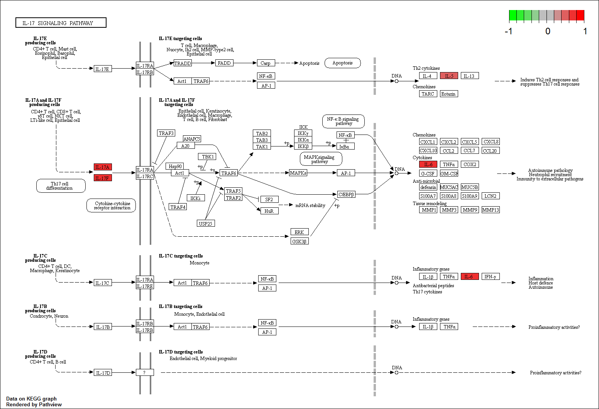
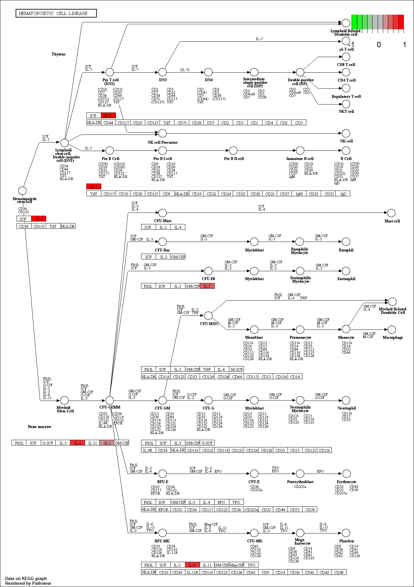

---
pdf_document:
  fig_caption: yes
author: "Cheng et al"
date: "Feb 2, 2019"
css: summarytools.css
output:
  html_document: null
  pdf_document: default
  toc: yes
geometry: margin=.25in
number_sections: yes
editor_options:
  chunk_output_type: console
title: "Luminex, Moya-moya CSF samples"
classoption: a3paper
toc: yes
---
  
# Overview: Analyze Luminex Run 1  
<div style="background-color: #d5d9e0;">
<br>The original data input has a duplicates.
<br>20-GS-IS18-33153172-151284-DX3	wells: D7,D6,
<br>23-GS-IS18-33153172-151284-DX3	wells: G7,G6,
<br>These two samples were averaged  together.  We think the tech might have run it twice because of free wells
<br>The averaging was done on the original excel in a seperate sheet. 
</div>

For the final data we are going with log2 transform no normalization.  We tested two other methods outlined by Rausch et al, 2016 ( log2 follow by quantile ) and ( asinh follow by loess ) however both did not perform as well as log2 and the best performer asinh follow by loess perform very similar.  Thus to reduce data manipulation and ambiguity we are are going with just log2 not transform. 

Diffrential differences was conducted with least mean square ( LMS ) with CHEX4 as a covariate.  All p-value are corrected by tukey test.   

```{r setup, include=FALSE, echo=FALSE, message=FALSE, warning=FALSE}
knitr::opts_chunk$set(include=F, echo=FALSE, message=FALSE, warning=FALSE)
```


```{r, include=FALSE, echo=FALSE, message=FALSE, warning=FALSE}
source ( "config.R")

# NOTE THERE ARE NO KEYS!  the data file contains the key 

data <- read.xlsx( data.file , sheet="remove.dup.62Plex", colNames = TRUE)
# clean up ID names 
data$ID = as.character ( sapply ( data$ID, function(x) str_match(x, ".*?\\-.*?\\-(.*?)-")[2] ) )


## create key here 
key = data[ , 1:3]

## clean up data 
df.data = t ( data[ ,5:ncol(data)] )
colnames ( df.data ) = data$ID
df.data = data.frame ( df.data )
# transform log2 
df.data.raw = df.data 
log2.p1 = log2 ( df.data + 1 )
df.data = log2 ( df.data )

## plot box plot to look at sample distribution. 

# log2 no normalize

box.raw = boxv (df.data, key, "log2 no normalize ")    

# log2 qn normalize
df.qn = data.frame ( normalize.quantiles( as.matrix ( df.data)  ) )
colnames ( df.qn ) = colnames( df.data)
row.names ( df.qn ) = row.names ( df.data )
box.qn = boxv ( df.qn, key, "log2 quantile normalize")

# asinh loess normalize 
### we decided not to do this anymore 
#df.asinh = asinh( df.data.raw )
#df.asinh = normalize.loess( df.asinh , log.it = F)
#box.df.asinh = boxv (df.asinh, key, " asinh loess normalized ")    

# OK! chose which one you wan to use! 

main = df.data
key2 = key 
file.name = "log2.noNorm"


#####
temp = melt ( main  )
colnames(temp) = c("ID", "value")
temp$group = as.character ( sapply ( temp$ID,  function(x)  unique ( key [ key$ID  == x, ]$group)  ) )

  g = ggplot(temp  , aes(value, fill=group, colours=group)) + geom_density(alpha=0.1) + 
      theme_bw()  + facet_wrap( ~ group , ncol=1, scales = "free_y"  ) 
  plot ( g )
  

# get and extract chex4 
chex = main [ grepl ( "CHEX4", row.names(main)), , drop=FALSE]
# remove all CHEX 
main = main[ !grepl ( "CHEX", row.names(main)), ]

key2$chex4 = as.numeric ( chex )


```


# Key 

```{r, message=FALSE, warning=FALSE,fig=TRUE,fig.width=8, fig.height=6, echo=FALSE, include=TRUE } 

D2.a = which ( key2$group == "Control" ) # #578be0
D2.b = which ( key2$group == "MMD-ischemic" ) #c2d2ed

D2.c = which ( key2$group == "MMD-hem" ) # # #74bc6f


kable( key2 , format = "html", booktabs = T, caption = "Key") %>%
   kable_styling(bootstrap_options = c("striped", "hover", "condensed")) %>%
row_spec( D2.a  , bold = T, color = "black", background = "#f45f42") %>%
row_spec( D2.b , bold = T, color = "black", background = "#65aece") %>%
row_spec( D2.c , bold = T, color = "black", background = "#8ac669") %>%
footnote( symbol = c ( "Chex4 is included to show non-specific binding") )


key2$color = ifelse ( key2$group == "Control", "#f45f42", 
                      ifelse ( key2$group == "MMD-ischemic", "#65aece", "#8ac669")
                      )


```


# Density plot 
shows that log2 transformation normalizes the values and importantly three groups have similar shape and values. 

```{r, message=FALSE, warning=FALSE,fig=TRUE,fig.width=8, fig.height=6, echo=FALSE, include=TRUE } 
 plot ( g )

```


# boxplot 
there were no apparent outlier sample 

```{r, message=FALSE, warning=FALSE,fig=TRUE,fig.width=8, fig.height=6, echo=FALSE, include=TRUE } 

box.raw

```


```{r}


# this is corrrecting for chex4 
main2 = apply ( main, 1, function(x) x/key2$chex4)
main2 = t ( main2 )


res.pca <- PCA( t( main ), graph = FALSE)
# plot the PCA
p <- fviz_pca_ind(res.pca, label="none", addEllipses=TRUE, ellipse.level=0.95,  axes = c(1, 2))
p2 <- p +geom_point(aes(colour= key2$group, shape= factor(key2$group) ), size=8.0, alpha=.5  )
p2 = p2 + scale_color_discrete(name="") + scale_shape_discrete(name="")

## dendogram now 
 par(mar=c(5,2,5,10))
 
 d2 <- dist(t ( main ) , method = "euclidean") # manhattan
 fit2 <- hclust(d2, method="ward.D2") 
 dend <- as.dendrogram(fit2)
 # plot first to guess how many branches to cut.  Statistically we can us gapstat but its not necessary here
 km =  4
 
 dend1 <- color_branches(dend, k = km , col =  getPalette (km) )  %>% dendextend::set("branches_lwd", c(8))
 # if you plot now then you will get color of each branch, plot ( dend1, horiz=T)
 

 hdf = data.frame ( cutree(fit2, k = km) )
 colnames(hdf) = "sample"
 

 color.group =  key2$color
 names ( color.group )= unique ( key2$group )
 
 
 
  
 
 

# plot single to show how kras expression effects overall distribution 
gk = 'BDNF'
gk = c('BDNF','NGF')
g = plot.gene ( main [row.names(main) %in% gk,], key.single=key2, ptext="",title= gk, pid="ID", key.c="group", add=0)
#g$bee + ylab ("log2")

ggap = fviz_nbclust(t ( main ), hcut, nstart = 25,  method = "gap_stat", nboot = 200)+
  labs(subtitle = "Gap statistic method")


```


# PCA Unsupervised 

Here we see that Dimension 1 explains about 61% of the variance.  There are not clear grouping there however there is a slight pattern between the groups. 

```{r, message=FALSE, warning=FALSE,fig=TRUE,fig.width=8, fig.height=6, echo=FALSE, include=TRUE } 
p2
```


# Unsupervised Hierarchical clustering with euclidean distance using the Ward.2 method 
This is easier to see and again, we see a slight grouping of the control group and possibly the two MMD subgroups.  This is not perfect however given the small protein set and the nature of the experimental design and workflow its quite good. Although there are only three groups Gap statistics seem to indicate that there are between 3-4, thus we highlight this in the HR below. The side bar color codes the three groups. 

```{r, message=FALSE, warning=FALSE,fig=TRUE,fig.width=6, fig.height=4, echo=FALSE, include=TRUE } 

ggap
```

```{r, message=FALSE, warning=FALSE,fig=TRUE,fig.width=7, fig.height=9, echo=FALSE, include=TRUE } 
par(mar=c(5,5,5,10))
  # bottom, left, top and right 
  
plot ( dend1, horiz=T) 
 colored_bars(colors = cbind ( Group = color.group ), dend = dend1, sort_by_labels_order = TRUE, horiz = T)

```


```{r}

main3 = melt ( t ( main ) )
colnames ( main3  ) = c("ID","gene","value")
main3 = merge ( main3, key2, by = "ID")

lmean = function (x ){
    bd = main3[main3$gene == x, ]
    
    bd.lm = lm(value ~ group + chex4 , data = bd)
    result = lsmeans::lsmeans(bd.lm,
        pairwise ~ group,
        adjust="tukey")

    r = summary ( result )
    return ( r$contrasts$p.value )
    
    
    
}


results = data.frame (  )
# go through each gene and analyze 
for (i in unique ( main3$gene ) ){
    l = lmean ( i )
    l = as.numeric ( l)
    
    results = rbind ( results, t( data.frame ( l )) )
}

colnames ( results )= c( "Control - MMD-hem" , "Control - MMD-ischemic", "MMD-hem - MMD-ischemic" )


results$gene = as.character ( unique ( main3$gene ) )


#write.xlsx( results, paste0(out.dir, file.name , ".xlsx" ), sheetName = file.name , firstRow=TRUE, tabColour= #"#ed8f55",
 # col.names = TRUE, row.names = FALSE, append = FALSE)

wb <- createWorkbook()
addWorksheet(wb, 'general')
    writeData(wb, 'general', results)
    
colnames ( results ) = c("hem","isch","hem.isch", "gene")

```

```{r}
# we have two comparisons 
key.c.mmd.hem = key2[key2$group %in% c("Control", "MMD-hem"), ] 
key.c.mmd.isch = key2[key2$group %in% c("Control", "MMD-ischemic"), ] 


### get all the data related to hem and control 
df.mmd.hem = data.frame ( main[, key.c.mmd.hem$ID] )
df.mmd.hem = setcolorder(df.mmd.hem, key.c.mmd.hem$ID )
# combine this with p value for hem vs control only 
df.mmd.hem = merge ( results[, c("gene","hem")], df.mmd.hem, by.y = "row.names", by.x="gene")
colnames ( df.mmd.hem )[2] = "p.tukey"
# get logfc for hem vs control 
# we need to exclude the first row. also assum that the order with thekey matches! 
logfc.hem = as.numeric ( apply(df.mmd.hem[, 3:ncol(df.mmd.hem) ] , 1, function(x){
     mean ( x[which ( key.c.mmd.hem$group == "MMD-hem")]) - 
     mean ( x[which ( key.c.mmd.hem$group == "Control")] ) 
}) )

df.mmd.hem = cbind ( data.frame(logfc=logfc.hem), df.mmd.hem)


### get all the data related to isch and control 
df.mmd.isch = data.frame ( main[, key.c.mmd.isch$ID] )
df.mmd.isch = setcolorder(df.mmd.isch, key.c.mmd.isch$ID )
# combine this with p value for isch vs control only 
df.mmd.isch = merge ( results[, c("gene","isch")], df.mmd.isch, by.y = "row.names", by.x="gene")
colnames ( df.mmd.isch )[2] = "p.tukey"
# get logfc for isch vs control 
# we need to exclude the first row. also assum that the order with thekey matches! 
logfc.isch = as.numeric ( apply(df.mmd.isch[, 3:ncol(df.mmd.isch) ] , 1, function(x){
     mean ( x[which ( key.c.mmd.isch$group == "MMD-ischemic")]) - 
     mean ( x[which ( key.c.mmd.isch$group == "Control")] ) 
}) )

df.mmd.isch = cbind ( data.frame(logfc=logfc.isch), df.mmd.isch)

###### 

## post analysis for hem 


```

```{r}

fdr = data.frame ( gene=df.mmd.hem$gene, fdr = df.mmd.hem$p.tukey )

df.mmd.hem = merge ( fdr, df.mmd.hem, by="gene")

# P.Value < p.val & result.gene$adj.P.Val < fdr & (result.gene$logFC
colnames ( df.mmd.hem )[2:4] = c("adj.P.Val","logFC","P.Value")

rsub = colnames ( df.mmd.hem[1:4])

this.color = key.c.mmd.hem$color

post.mmd.hem <- plot.post ( df.mmd.hem, "group", "group" , key.c.mmd.hem, rsub, exp.group="group", exp.this="MMD-hem", normal.this= "Control", sample.id="ID", GENE_SYMBOL = "gene", fdr=.05, fold_thres = .20, title1 = "mmd.hem", top10 =NA)

## post analysis for isch 
fdr = data.frame ( gene=df.mmd.isch$gene, fdr = df.mmd.isch$p.tukey )

df.mmd.isch = merge ( fdr, df.mmd.isch, by="gene")

# P.Value < p.val & result.gene$adj.P.Val < fdr & (result.gene$logFC
colnames ( df.mmd.isch )[2:4] = c("adj.P.Val","logFC","P.Value")

rsub = colnames ( df.mmd.isch[1:4])

this.color = key.c.mmd.isch$color
post.mmd.isch <- plot.post ( df.mmd.isch, "group", "group" , key.c.mmd.isch, rsub, exp.group="group", exp.this="MMD-ischemic", normal.this= "Control", sample.id="ID", GENE_SYMBOL = "gene", fdr=.05, fold_thres = .20, title1 = "mmd.isch", top10 =NA)


dge.c.mmd.hem = results[results$hem < .05,  ]
dge.c.mmd.isch = results[results$isch < .05,  ]


addWorksheet(wb, 'ischemia')
    writeData(wb, 'ischemia', post.mmd.isch$data)
    
addWorksheet(wb, 'hemorrhagic')
    writeData(wb, 'hemorrhagic', post.mmd.hem$data)
    
    

# lets do a venn diagram here 

g1 <-
  compute.Venn(
    Venn ( list (
      "mmd.hem" = unique (dge.c.mmd.hem$gene),
      "mmd.isch" = unique ( dge.c.mmd.isch$gene )

      )

      ) ,
    doWeights = TRUE, type="circles"
    # or circles
    )


# plot (g2) or set your own color with gp
gp <- VennThemes(g1)
gp[["Face"]][["10"]]$fill <-  "#a6cee3"
gp[["Face"]][["11"]]$fill <-  "#fdbf6f" # middle
gp[["Face"]][["01"]]$fill <-  "#b2df8a"
gp$Set[["Set1"]]$col <- "grey"
gp$Set[["Set2"]]$col <- "grey"
gp$SetText[["Set1"]]$col <- "black"
gp$SetText[["Set2"]]$col <- "black"

shared.dge = intersect (unique ( dge.c.mmd.isch$gene ), unique ( dge.c.mmd.hem$gene ) )

```


# Venn Diagram 

Comparing Differential p < .05 from both groups.  
Both ischemic vs control and hemorrhagic vs control appears to be very similar 

```{r, message=FALSE, warning=FALSE,fig=TRUE,fig.width=8, fig.height=4, echo=FALSE, include=TRUE } 

grid.newpage()
plot(g1, gp = gp)

```

# Below are a few peptides with the highest fold change and significant 

Notice how small the differences are.  We need to look at the literature or ask how luminex works. 

```{r, message=FALSE, warning=FALSE,fig=TRUE,fig.width=8, fig.height=16, echo=FALSE, include=TRUE } 

t1 = post.mmd.hem$data
t2 = post.mmd.isch$data

t1 = t1[t1$class != "no-change", ]
t1 = t1[ order (-abs(t1$logFC)), ]

t2 = t2[t2$class != "no-change", ]
t2 = t2[ order (-abs(t2$logFC)), ]

tt = as.character ( unique ( t1$gene[1:10], t2$gene[1:10]) )

gk = tt
g = plot.gene ( main [row.names(main) %in% gk,], key.single=key2, ptext="",title= gk, pid="ID", key.c="group", add=0,
                vps=2)$bee

g

```


```{r}

main.sub = main [ row.names ( main ) %in% shared.dge, ]

par(mar=c(5,2,5,10))
 
 d2 <- dist(t ( main.sub ) , method = "euclidean") # manhattan euclidean
 fit2 <- hclust(d2, method="ward.D2") 
 dend <- as.dendrogram(fit2)
 # plot first to guess how many branches to cut.  Statistically we can us gapstat but its not necessary here
 km =  3
 
 dend2 <- color_branches(dend, k = km , col =  getPalette (km) )  %>% dendextend::set("branches_lwd", c(8))
 # if you plot now then you will get color of each branch, plot ( dend1, horiz=T)
 

 hdf = data.frame ( cutree(fit2, k = km) )
 colnames(hdf) = "sample"
 

 color.group =  key2$color
 names ( color.group )= unique ( key2$group )
 


```


# Supervised Hierarchical clustering with euclidean distance using the Ward.2 method 
We used genes that were signficant in both groups

```{r, message=FALSE, warning=FALSE,fig=TRUE,fig.width=8, fig.height=10, echo=FALSE, include=TRUE } 
par(mar=c(5,5,5,10))
  # bottom, left, top and right 
  
plot ( dend2, horiz=T) 
 colored_bars(colors = cbind ( Group = color.group ), dend = dend1, sort_by_labels_order = TRUE, horiz = T)

```


# Post plots on hemorrhagic group

```{r, message=FALSE, warning=FALSE,fig=TRUE,fig.width=8, fig.height=9, echo=FALSE, include=TRUE } 

post.mmd.hem$hm
post.mmd.hem$scatter

```


# Post plots on ischemic group

```{r, message=FALSE, warning=FALSE,fig=TRUE,fig.width=8, fig.height=9, echo=FALSE, include=TRUE } 

post.mmd.isch$hm
post.mmd.isch$scatter

```

```{r}
# lets do some analysis here 
human = readRDS(human.file)
GO.hem <- get.go (
   post.mmd.hem$data [post.mmd.hem$data$class != "no-change", ] , human ,g.name="gene", 
  bg = as.character ( post.mmd.hem$data$gene ), species="Hs"
) 

dfkegg.hem = gene.data=post.mmd.hem$data [post.mmd.hem$data$class != "no-change", ]$logFC
names (dfkegg.hem ) = gene.data=post.mmd.hem$data [post.mmd.hem$data$class != "no-change", ]$gene

GO.isch <- get.go (
   post.mmd.isch$data [post.mmd.isch$data$class != "no-change", ] , human ,g.name="gene", 
  bg = as.character ( post.mmd.isch$data$gene ), species="Hs"
) 

dfkegg.isch = gene.data=post.mmd.isch$data [post.mmd.isch$data$class != "no-change", ]$logFC
names (dfkegg.isch ) = gene.data=post.mmd.isch$data [post.mmd.isch$data$class != "no-change", ]$gene


pathID <- "04657" 
pview <- pathview(gene.data=dfkegg.hem,
                  gene.idtype="SYMBOL",
                  pathway.id=pathID,
                  species="hsa",
                  out.suffix="kegg",
                  kegg.native=T,
                  same.layer=T)


pathID <- "04640" 
pview <- pathview(gene.data=dfkegg.hem,
                  gene.idtype="SYMBOL",
                  pathway.id=pathID,
                  species="hsa",
                  out.suffix="kegg",
                  kegg.native=T,
                  same.layer=T)


addWorksheet(wb, 'kegg.hem')
    writeData(wb, 'kegg.hem', GO.hem$kegg)
    
addWorksheet(wb, 'MF.hem')
    writeData(wb, 'MF.hem', GO.hem$mf)    
addWorksheet(wb, 'BP.hem')
    writeData(wb, 'BP.hem', GO.hem$bp) 
    
addWorksheet(wb, 'MF.isch')
    writeData(wb, 'MF.isch', GO.isch$mf)    
addWorksheet(wb, 'BP.isch')
    writeData(wb, 'BP.isch', GO.isch$bp)     

```


# Displaying some of the more interesting KEGG pathways. Please see the excel sheet for more info
* genes are annotted as long as p< .05 
* fold changes are color coded
* Keep in mind that there are only a few genes in the dataset so pathways analysis is a bit odd. 

```{r kegg,  out.width = "2000px", include=TRUE}

   
       
  

```


```{r}
# finalize everything. 

saveWorkbook(wb, file = paste0(out.dir,"results.xlsx"), overwrite = TRUE)

```
                  
                  


